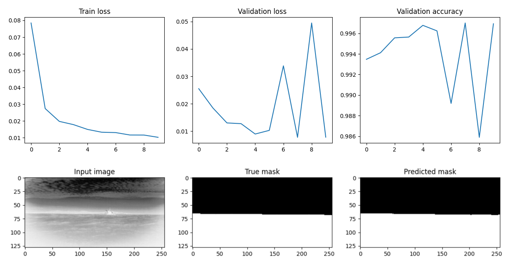
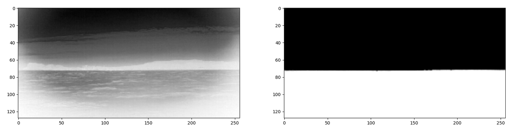

# U-Net for Image Segmentation

<div align="center">
    
</div>

## Objective  
The objective of this project is to train and test a U-Net semantic segmentation model on a Horizon Dataset by Exail Technologies. The network will process infrared images captured by a camera mounted on an autonomous drone boat. The purpose of the segmentation task is to distinguish the sea from the sky. This segmentation will serve two primary purposes:
- Filtering out detections located in the sky.
- Calculating the distance of a detection relative to the camera based on its distance from the horizon.

## Overview  
U-Net is a convolutional neural network architecture designed for image segmentation tasks. It was originally developed for biomedical image segmentation but has since been widely used in various fields, such as medical imaging, satellite imagery, and object segmentation. The key advantage of U-Net is its ability to efficiently capture both spatial and contextual information using its encoder-decoder structure.

## Why U-Net for Segmentation?  
- **Efficient Feature Learning**: U-Net's contracting and expanding paths help learn both low-level and high-level features.
- **Skip Connections**: These allow detailed spatial information from early layers to be preserved, improving segmentation accuracy.
- **Works with Limited Data**: U-Net can achieve high performance even with a small training dataset through its data augmentation techniques.

## U-Net Architecture  
Below is the architectural diagram of the U-Net model:

<div align="center">
    
    <p><b>U-Net Architecture</b></p>
</div>

The network consists of:
- **Encoder (Contracting Path)**: Extracts key features using convolutional layers.
- **Bottleneck**: Acts as a bridge between the encoder and decoder.
- **Decoder (Expanding Path)**: Restores spatial resolution and refines segmentation.

## Training Process  
The U-Net model was trained on the Horizon Dataset using PyTorch. Below are the training parameters used:

```
    learning_rate = 1e-4,
    batch_size = 4,
    epoch_numbers = 10,
    device = "cuda"
```

<div align="center">
    
    <p>U-Net Training Curves</p>
</div>

## Model Results  
<div align="center">
    
    <p>U-Net Horizon Segmentation Result</p>
</div>
